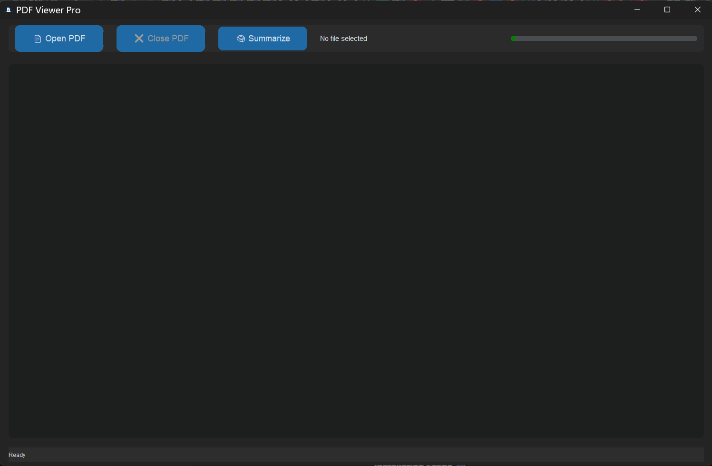
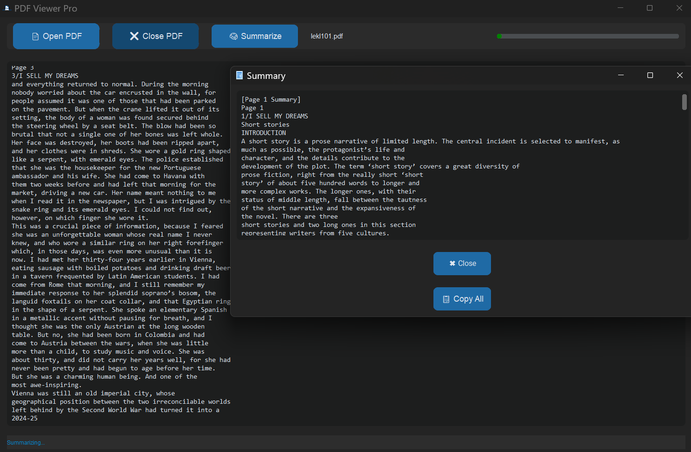
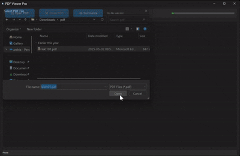

# 🎉 PDF Viewer Pro - The Ultimate PDF Experience! 📚

Welcome to **PDF Viewer Pro**, a sleek and powerful Python application designed to view, summarize, and manage your PDF files with ease! 🌐 Built with love using **customtkinter**, **PyMuPDF**, and **NLTK**, this tool brings a modern twist to PDF handling. Whether you're a student, researcher, or just someone who loves organizing documents, this app is for you! 🚀

---

## 🌟 What’s Inside This Awesome Tool?

Get ready to dive into a world of features that make PDF management a breeze:  

- **📄 Seamless PDF Loading**: Open any PDF file with a single click and watch it load page by page!  
- **🧠 Smart Summarization**: Automatically generate concise summaries for each page using natural language processing!  
- **📋 Copy to Clipboard**: Copy the entire text or summary with a click—perfect for notes or presentations!  
- **⏳ Real-Time Progress**: Track loading progress with a stylish green progress bar!  
- **❌ Close Anytime**: Safely close PDFs and reset the app without a hitch!  
- **🎨 Modern Dark Theme**: Enjoy a visually appealing dark mode interface with customtkinter!  

---

## 📸 Screenshots - See It in Action!

1. **Main Interface** 🎨:  
     
   *The sleek dashboard with open, summarize, and close options!*  

2. **Summary Window** 🧠:  
     
   *A pop-up showing a smart summary with a copy button!*  

3. **Progress in Action** ⏳:  
     
   *Watch the progress bar light up as your PDF loads!*  

*(Note: Replace the screenshot paths with actual image files in your project folder!)*  

---

## 🚀 Getting Started - Install and Run!

### Prerequisites 🛠️
Before you jump in, make sure you have:  
- **Python 3.x** 🐍 (latest version recommended)  
- Internet connection (for downloading NLTK data)  

### Installation Steps 📥
1. **Clone or Download** the project files to your local machine.  
2. **Install Dependencies** by running this command in your terminal:  
   ```bash
   pip install customtkinter PyMuPDF nltk pillow
   ```
3. **Run the App** 🎉:  
   Navigate to the project folder and execute:  
   ```bash
   python pdf_viewer_pro.py
   ```
4. **Download NLTK Data**: The first run will automatically download `punkt` and `stopwords`—just follow the prompts!  

### Required Files 📂
- `logo.png`: The app icon (place it in the project folder).  
- `summary_logo.png`: Icon for the summary window (place it in the project folder).  

---

## 🎮 How to Use It?

1. **Launch the App** 🚀: Double-click the script or run it via terminal.  
2. **Open a PDF** 📄: Click "📄 Open PDF", select your file, and watch the magic happen!  
3. **Explore the Text** 🔍: Scroll through the extracted text in the main window.  
4. **Get a Summary** 🧠: Hit "🧠 Summarize" to see a concise overview in a new window.  
5. **Copy Text** 📋: Use the "📋 Copy All" button to grab the summary or full text.  
6. **Close PDF** ❌: Click "❌ Close PDF" to start fresh with a new file.  

**Pro Tip**: The progress bar keeps you updated, and the status bar gives real-time feedback! 😄  

---

## 🛠️ Technical Deep Dive

### Libraries in Action 📚
- **customtkinter**: Powers the stunning GUI with a dark theme and responsive design.  
- **PyMuPDF (fitz)**: Extracts text from PDF files page by page with high efficiency.  
- **NLTK**: Uses natural language processing to summarize text based on word frequency.  
- **Pillow**: Handles image icons for a polished look.  
- **threading**: Ensures smooth background processing without freezing the UI.  

### How It Works Under the Hood 🧑‍💻
- **PDF Processing**: The app opens the PDF in a separate thread, reading each page and updating the UI dynamically.  
- **Summarization Algorithm**:  
  - Tokenizes the text into sentences and words.  
  - Removes stopwords (common words like "the" or "and").  
  - Scores sentences based on word frequency and selects the top 5 for each page.  
- **Thread Safety**: A `Lock` mechanism prevents race conditions during multi-threaded operations.  
- **UI Updates**: All UI changes (text, progress, status) are scheduled with `after(0)` to avoid thread conflicts.  

### Design Choices 🎨
- **Dark Theme**: Reduces eye strain and looks super cool!  
- **Responsive Layout**: The grid system adjusts to window size.  
- **Color Coding**: Status messages use colors (green for success, red for errors) for quick recognition.  

---

## 💡 Tips for Users and Developers

- **For Users** 😊:  
  - Try PDFs with lots of text—summarization works best there!  
  - Keep the `logo.png` and `summary_logo.png` files in the folder to avoid icon errors.  
  - If the app freezes, wait a bit or close and reopen it.  

- **For Developers** 👨‍💻:  
  - **Customize Summaries**: Tweak the `max_sentences` in `_summarize_pages` for longer or shorter outputs.  
  - **Add Languages**: Extend `stopwords` support for other languages (e.g., Spanish, French).  
  - **Optimize Memory**: Limit the number of pages loaded at once for huge PDFs.  
  - **Enhance UI**: Add buttons for page navigation or search functionality!  

---

## ⚠️ Known Limitations
- **Large PDFs**: May slow down on files with hundreds of pages due to memory usage.  
- **Language Support**: Currently optimized for English text only.  
- **Error Handling**: Basic exception catching—more robust checks could be added.  

---

## 🎁 Future Ideas
- 🌍 **Multi-Language Support**: Add summarization for other languages.  
- 🔍 **Search Feature**: Let users search within the PDF text.  
- 📤 **Export Options**: Save summaries as text files.  
- 🎨 **Themes**: Offer light mode or custom color schemes.  

---

## 📧 Get in Touch
Got questions or cool ideas? Reach out to the author:  
- **Author**: Arshia  
- **Email**: [arshia82sbn@gmail.com](mailto:arshia82sbn@gmail.com)  
